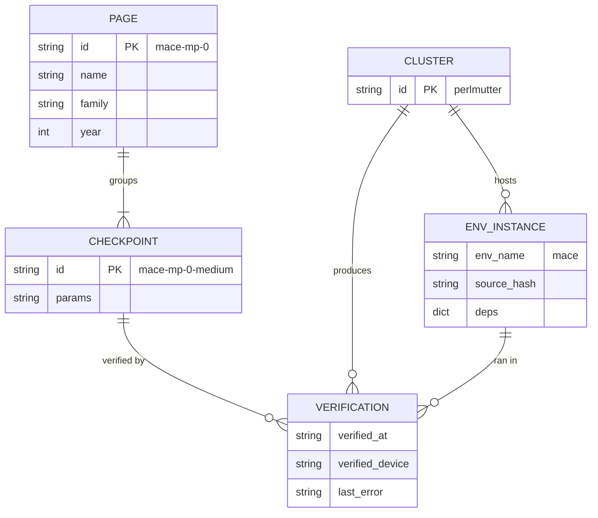
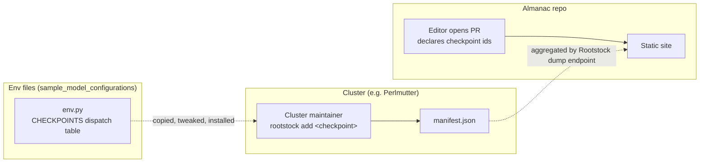

# How models, checkpoints, envs, and clusters fit together

**Status:** Approved.
**One-line summary:** Make the *checkpoint identifier* (e.g. `mace-mp-0-medium`, `uma-s-1p1`) the single canonical name shared by the Almanac, Rootstock env files, and cluster manifests — so the Availability Table tells the truth and so cluster maintainers can light up cells just by running `rootstock add <checkpoint>`.

---

## Intro/Context

The main place where clusters need to “talk” to the frontend is via the availability table that shows what models are known to work on which clusters. How should we link the models configured on clusters to metadata on the Almanac?

Some design principles I kept in mind here:
- We want to track availability by checkpoint, not by model family. An agent needs to know if MACE-MP-0 medium is available. Knowing that some variant of MACE is running doesn’t help much. Every row in the availability table should map unambiguously to a known checkpoint that is the same on different clusters.
- We want to keep the concept of environments and models separate. Environments (the UV envs specified by Groundhog-like code files) will not map cleanly on to model pages in the almanac. For example, MACE-MP and MACE-OFF share the same packages and should probably be in the same environment. But both conceptually and in terms of publications, probably deserve separate model pages on the website.
- The almanac explicitly lists the checkpoints it knows about, and clusters say which checkpoints they offer. Cluster maintainers can experiment and serve models that the Almanac doesn’t know about. But those won’t show up in the availability table.

## The data model



### Entities at a glance

| Entity | What it is | Where it lives | Authored by |
|---|---|---|---|
| **Page** | An editorial entry — the encyclopedia article ("MACE-MP-0") | Almanac repo (`src/content/models/*.json`) | Almanac PR |
| **Checkpoint** | A specific set of trained weights, named by a canonical identifier ("mace-mp-0-medium") | Declared in Almanac; verified on each cluster | Almanac PR (declared); cluster manifest (verified) |
| **Cluster** | A piece of HPC ("perlmutter"). Identified by the same name in the Almanac entry and in the cluster's `manifest.cluster` field. | Almanac repo (`src/content/clusters/*.json`); name echoed in `manifest.cluster` | Almanac PR (entry); cluster maintainer (manifest field) |
| **EnvInstance** | A Python venv built on a particular cluster, with deps and a `setup()` function ("mace on perlmutter") | Cluster manifest | Cluster maintainer (`rootstock install`) |
| **Verification** | A checkpoint smoke-tested on a cluster, with a timestamp | Cluster manifest | Cluster maintainer (`rootstock add` / `smoke-test`) |

Notice that **`EnvInstance` is invisible to the Almanac data model.** Envs are an implementation concern of running things on clusters. The Almanac may *display* env info (source code, deps) for users curious about how a model runs on a particular cluster — but it does so by reading manifests, not by declaring envs itself.

**Two cross-system join keys, agreed by convention:**
- **Cluster identifier** (column join). The Almanac's `src/content/clusters/perlmutter.json` and the cluster's `manifest.cluster: "perlmutter"` field have to match.
- **Checkpoint identifier** (row join). The Almanac's `checkpoints[].id` and the cluster's `environments[env].checkpoints[<id>]` keys have to match.

Neither is enforced at runtime; both are coordinated by humans.

### The matrix is one query

> For each `(checkpoint, cluster)` pair: is there a `Verification` in the last 7 days?

That's it. ● if yes, ○ if there's a stale or errored one, hatched if there's none.

---

## Two identifier levels

The proposal hinges on distinguishing two kinds of identifier:

| | Page identifier | Checkpoint identifier |
|---|---|---|
| **Examples** | `mace-mp-0`, `uma`, `tensornet-matpes` | `mace-mp-0-small`, `mace-mp-0-medium`, `mace-mp-0-large`, `uma-s-1p1` |
| **Cardinality** | one per published model | one or more per page |
| **Where it appears** | Almanac URL: `/model/mace-mp-0` | Matrix row, `rootstock add <checkpoint>`, `RootstockCalculator(checkpoint=...)`, manifest keys, env file `CHECKPOINTS` dispatch |

The two need not be prefix-related. `uma` (page) and `uma-s-1p1` (checkpoint) is fine; `tensornet-matpes` (page) and `tensornet-matpes-pbe-2025-2` (checkpoint) is fine.

The matrix has one row per *checkpoint*; each row's name links to its *page*. So three explicit MACE-MP-0 rows, one MACE-MP-0 page.

---

## Worked example — MACE-MP-0

**Almanac entry** (`src/content/models/mace-mp-0.json`):

```json
{
  "name": "MACE-MP-0",
  "family": "ace",
  "year": 2023,
  "leadAuthor": "Batatia et al.",
  "checkpoints": [
    { "id": "mace-mp-0-small",  "params": "2.0M"  },
    { "id": "mace-mp-0-medium", "params": "4.7M"  },
    { "id": "mace-mp-0-large",  "params": "15.6M" }
  ]
}
```

Notice: **no env reference**, no library-specific dispatch info. The Almanac entry is purely editorial.

**Cluster maintainer**, on a cluster that already has the `mace` env installed, runs:

```sh
rootstock add mace-mp-0-medium    # on perlmutter
rootstock add mace-mp-0-medium    # on della
rootstock add mace-mp-0-large     # on della
```

**Resulting matrix slice:**

| | Perlmutter | Della | Frontier |
|---|---|---|---|
| MACE-MP-0 · S | hatched | hatched | hatched |
| MACE-MP-0 · M | ● 2d ago | ● 1d ago | hatched |
| MACE-MP-0 · L | hatched | ● 12d ago (lapsed → ○) | hatched |

The cluster maintainer never had to touch the Almanac. The slug they typed already had an Almanac entry, and `rootstock add` recorded the verification under that canonical name in the cluster manifest. The Almanac picked it up on its next build.

---

## How the data flows



Two things to notice:

1. **There's no runtime dependency from clusters to the Almanac.** Clusters are self-contained. The Almanac is purely downstream.
2. **The two repos agree on checkpoint identifiers by convention, not by code contract.** The Almanac is the public list of canonical identifiers — env file authors and cluster maintainers should match those identifiers when they declare what their env can dispatch. CI checks (see open question §6) can flag drift, but no system enforces consistency at runtime.

---

## The env file as local dispatch

Each env file declares a `CHECKPOINTS` dict mapping canonical checkpoint identifiers → whatever the upstream library wants:

```python
# environments/mace.py
"""MACE env — hosts MACE-MP and MACE-OFF checkpoints."""

CHECKPOINTS = {
    "mace-mp-0-small":   "small",
    "mace-mp-0-medium":  "medium",
    "mace-mp-0-large":   "large",
    "mace-off23-medium": "off:medium",
}

def setup(checkpoint, device="cuda"):
    arg = CHECKPOINTS[checkpoint]
    if arg.startswith("off:"):
        return mace_off(model=arg[4:], device=device, default_dtype="float32")
    return mace_mp(model=arg, device=device, default_dtype="float32")
```

`CHECKPOINTS` is **internal dispatch infrastructure, not a user-facing catalog.** Users only ever see what's actually cached and verified, sourced from the manifest. The constant exists so that:

- `rootstock add <checkpoint>` can find the right env to install into.
- A typo errors immediately ("no installed env declares `mace-mp-0-medum`") instead of failing inside a `setup()` call.
- A new cluster maintainer copying `mace.py` from `sample_model_configurations/` can see at a glance which checkpoints the env is set up to handle.
- A maintainer with quirky hardware can ship a variant (e.g. `mace_rocm.py`) that supports a strict subset of identifiers, without breaking the contract.

The env file is the only place where a canonical checkpoint identifier becomes a concrete library call. It's also the only place where per-cluster variation lives — a NVIDIA `mace.py` and a ROCm `mace.py` can have different deps and different internal dispatches but agree on the checkpoint identifiers they advertise.

---

## What changes from today

| | Today | Proposed |
|---|---|---|
| Identifier in `RootstockCalculator` | `model="mace", checkpoint="medium"` | `checkpoint="mace-mp-0-medium"` |
| Rootstock CLI | `rootstock add mace medium` | `rootstock add mace-mp-0-medium` |
| Almanac model JSON | `rootstockEnv` field, no checkpoint info | `checkpoints[]` array; no env reference at all |
| Env name convention | `mace_env` | `mace` (drop `_env` suffix everywhere) |
| Env file | `setup(model, device)` accepts any string | `setup(checkpoint, device)` dispatches via a `CHECKPOINTS` constant |
| Manifest schema | v2, env keys end in `_env`, checkpoint keyed by upstream library string | v3, env keys are bare, checkpoint keyed by canonical identifier |
| Matrix data | Faked from a hash | Real, from `verified_at` (≤ 7 days = fresh) |

---

## Where to look in the repos

| Concern | Almanac | Rootstock |
|---|---|---|
| Schema | `src/content.config.ts` | `rootstock/manifest.py` (`SCHEMA_VERSION`) |
| Public-facing API | (n/a — static site) | `rootstock/calculator.py`, `rootstock/cli.py` |
| Matrix rendering | `src/pages/compatibility.astro` | — |
| Per-cluster page | `src/pages/cluster/[slug].astro` | — |
| Per-model page | `src/pages/model/[slug].astro` | — |
| Manifest fetch | `src/lib/rootstock.ts` | — |
| Env files (slug dispatch) | — | `sample_model_configurations/nvidia_configs/*.py` |
| Add command | — | `rootstock/commands/add.py` |
